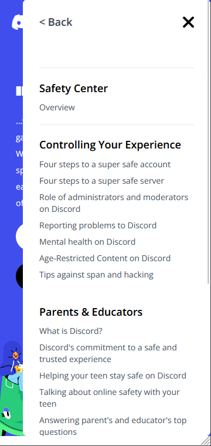
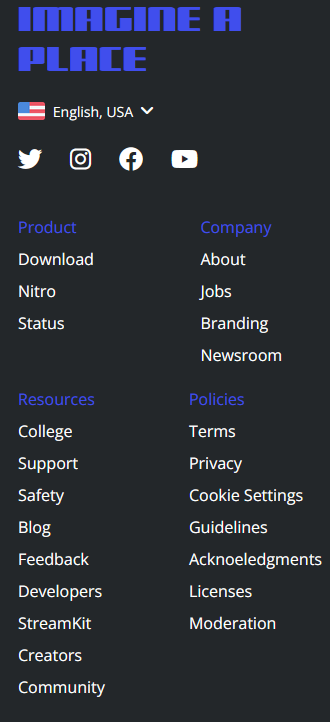
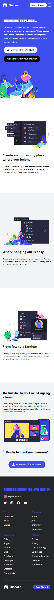
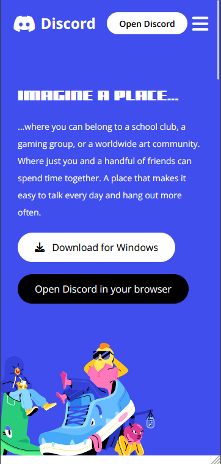
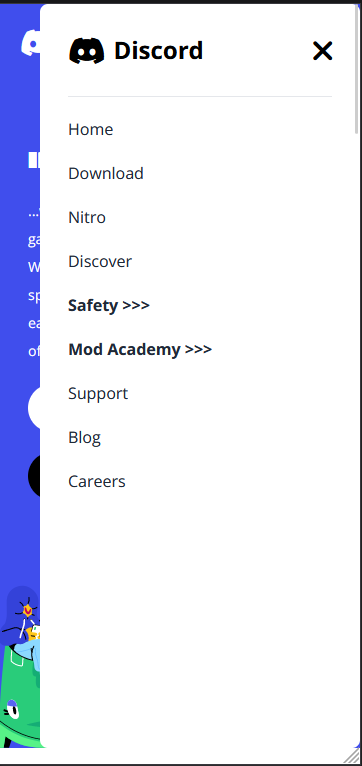
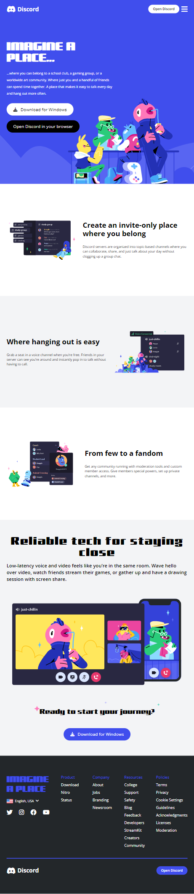
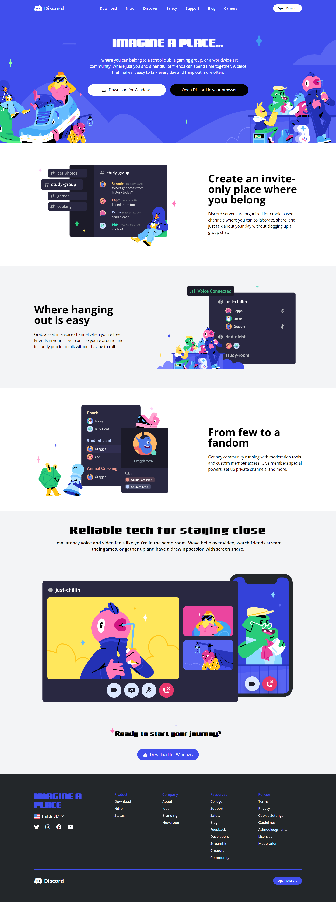

## Discord Landing Page : Introduction
This project is given by iNeuron, the EdTech Company as part of their recruiting assessment process for the role: **Software Engineer Trainee**. This assignment's main goal is to clone the [Discord Landing Page](https://discord.com/).

## Deployed Vercel Link of My Project.
Vercel Deployed Link : [Discord Landing Page Clone](https://discoordd-sandeep-k-dasari-ineuron.vercel.app/)

### Tech Stack, I've used!
- HTML5
- Tailwind CSS (FlexBox, Positions)
- Vannila Javascript ES6

## Why Javascript! (Open `discord.js` file)
- Open **`Discord.js`** and **`src/Helpers/Footer.js`** to read **javascript** which I have used to complete this project.
- You can get a simple doubt that why I have used so much Javascript.
- I have used Javascript to populate the **Navbar and SubNavlist** in the responsive mode.
- To achieve **Config Driven UI**, I have use Javascript, in case of NavBar and SubNavBar population into the web-page.
- I have followed **Functional Programming Pradigm** .

> I have used **Closures** in my design decision of **Event Listeners** of my project, Refer them in **discord.js** file.

> 1. I have created utility functions to follow **Functional Programming Pradigm** like **Create, select, Add** elements to the DOM as shown below:

```javascript
export const createEle = (type) => {
    try {
        const element = document.createElement(type);
        return element;
    } catch (error) {
        console.log(error.message);
    }
}

export const addChild = (parent,child) => {
    try {
        parent.appendChild(child);
    } catch (error) {
        console.log(error.message);
    }
} 

export const getByID = (id) => {
    try {
        const element = document.getElementById(id);
        return element;
    } catch (error) {
        console.log(error.message);
    }
}
```

> 2. I have created the Array of List which looks like this...

**To get the below Output**, instead of writing manually in `index.html` page, I have create an **`Array of Object`** and populated that into the **Hamburger NavBar** using **`Higher Order Function - map`**.



 ```javascript
const ResponsiveNavBarArray = [
    {
        navItem: "Home",
        subNavList: [],
    },
    {
        navItem: "Download",
        subNavList: [],
    },
    {
        navItem: "Nitro",
        subNavList: [],
    },
    {
        navItem: "Discover",
        subNavList: [],
    },
    {
        navItem: "Safety",
        subNavList: [
            {
                title: "Safety Center",
                navList: ["Overview"]
            },
            {
                title: "Controlling Your Experience",
                navList: [
                    "Four steps to a super safe account",
                    "Four steps to a super safe server",
                    "Role of administrators and moderators on Discord",
                    "Reporting problems to Discord",
                    "Mental health on Discord",
                    "Age-Restricted Content on Discord",
                    "Tips against span and hacking",
                ]
            },
            {
                title: "Parents & Educators",
                navList: [
                    "What is Discord?",
                    "Discord's commitment to a safe and trusted experience",
                    "Helping your teen stay safe on Discord",
                    "Talking about online safety with your teen",
                    "Answering parent's and educator's top questions",
                    "If your teen encounters an issue",
                    "Working with CARU to protect users on Discord"
                ]
            },
            {
                title: "How We Enforce Rules",
                navList: [
                    "Our policies",
                    "Enforcing our rules",
                    "How we investigate",
                    "What actions we take",
                    "How you can appeal our actions",
                    "Discord's Transparency Report",
                    "Working with law enforcement"
                ]
            },
        ],
    },
    {
        navItem: "Mod Academy",
        subNavList: [
            {
                title: "Moderator Academy",
                navList: ["Overview"]
            },
            {
                title: "Basics",
                navList: [
                    "100: An Intro to the DMA",
                    "103: Basic Channel Setup",
                    "104: How to Report Content to Discord",
                    "110: Moderator Etiquette",
                    "111. Your Responsibilities as a Moderator"
                ]
            },
            {
                title: "Setup and Function",
                navList: [
                    "201: Permissions on Discord",
                    "202: Handling Difficult Scenarios",
                    "203: Developing Server Rules",
                    "204: Ban Appeals",
                    "205: Utilizing Role Colors",
                    "206: Best Practices for Reporting Tools",
                    "210: Moderator Recruitment"
                ]
            },
            {
                title: "Advanced Community Management",
                navList: [
                    "301: Implementing Verification Gates",
                    "302: Developing Moderator Guidelines",
                    "303: Facilitating Positive Environments",
                    "310: Managing Moderation Teams",
                    "311: Understanding and Avoiding Moderator Burnout",
                    "312: Internal Conflict Resolution",
                    "313: How to Moderate Voice Channels",
                    "314: Training and Onboarding New Moderators",
                    "321: Auto Moderation in Discord",
                    "322: Usage and Benefits of Webhooks and Embeds ",
                    "323: Usage of XP Systems",
                    "331: Community Engagement",
                    "332: Fostering Healthy Communities",
                    "333: Planning Community Events",
                    "334: Community Partnerships",
                    "341: Understanding Your Community Through Insights"
                ]
            },
            {
                title:"Moderation Seminars",
                navList: [
                    "401: Transparency in Moderation",
                    "403: Sensitive Topics",
                    "405: Practicalities of Moderating Adult Channels",
                    "407: Managing Exponential Membership Growth",
                    "432: Internationalization of a Community",
                    "441: Community Governance Structures",
                    "442: Using Insights to Improve Community Growth and Engagement",
                    "443: Ban Evasion and Advanced Harassment",
                    "451: Reddit x Discord",
                    "452: Twitch x Discord",
                    "453: Patreon x Discord",
                    "454: Bringing Other Communities To Discord",
                    "455: Schools x Discord"
                ]
            },
            {
                title: "Graduate Courses",
                navList: ["531: Parasocial Relationships"]
            },
            {
                title: "Author Credits",
                navList: ["Author Credits"]
            }
        ],
    },
    {
        navItem: "Support",
        subNavList: [],
    },
    {
        navItem: "Blog",
        subNavList: [],
    },
    {
        navItem: "Careers",
        subNavList: [],
    }
]
```

> 3. Open **`src/Helpers/Footer.js`** file to see the code, which I have used to populate the **Footer Navigation** as shown below:

```javascript
const footerNavList = [
    {
        footerNavTitle: "Product",
        footerNavList: ['Download', 'Nitro', 'Status'],
    },
    {
        footerNavTitle: "Company",
        footerNavList: ['About', 'Jobs', 'Branding', 'Newsroom'],
    },
    {
        footerNavTitle: "Resources",
        footerNavList: ['College', 'Support', 'Safety', 'Blog', 'Feedback', 'Developers', 'StreamKit', 'Creators', 'Community'],
    },
    {
        footerNavTitle: "Policies",
        footerNavList: ["Terms", 'Privacy', 'Cookie Settings', 'Guidelines', 'Acknoeledgments', 'Licenses', 'Moderation'],
    },
]
```

# My Project is Responsive :)
## Project Outputs for three Screens (Apple Ipad Air, Galaxy S20, Desktop) 
**Open `screenshots` folder to view all the project's Output ScreenShots**

### Mobile View (Galaxy S20)


#### Mobile View Hamburger


#### Mobile View Hamburger Expanded


#### Mobile View Hamburger SubNavBar Expanded (Click `Safety` or `Mod Academy`)


> You can click `Back` button to close the sub navbar and `close` button to close the full Navigation.

### Tablet View (Apple Ipad Air)


### Desktop View (All Large Screens)

